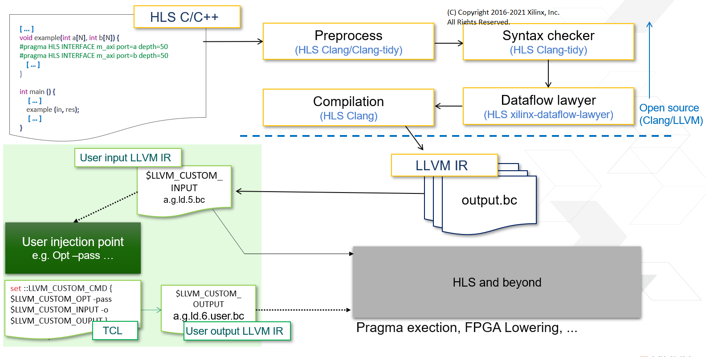

# Vitis HLS LLVM examples

Examples of how to use Vitis HLS with a local LLVM build and/or custom LLVM opt passes.

Example | Description      
--------|------------------
[override_llvm_flow_demo](override_llvm_flow_demo) | How to use local LLVM build within Vitis HLS.  Local LLVM will be used for both clang and opt phases.
[override_opt_flow_demo](override_opt_flow_demo) | How to use local LLVM opt binary within Vitis HLS.  
[plugin_analyze_rename_flow_demo](plugin_analyze_rename_flow_demo) | How to call a custom LLVM opt pass within Vitis HLS.  Requires [plugins/example_analyze_rename](../plugins/example_analyze_rename) to be built.  Does not require a local LLVM build.
[plugin_auto_array_partition_flow_demo](plugin_auto_array_partition_flow_demo) | How to use the auto_array_partition plugin within Vitis HLS.  Requires [plugins/auto_array_partition](../plugins/auto_array_partition) plugin to be built.  Does not require a local LLVM build.
[slxplugin_loopinterchange_demo](slxplugin_loopinterchange_demo) | How to use the SLX Plugin loop interchange optimization from the command line and from the Vitis HLS IDE. Does not require a local LLVM build.

Note that the override\* examples assume that the local LLVM binaries have some customized behavior/passes which will be called implicitly or explicitly in the run_hls.tcl.


## How to run Vitis HLS project examples
1. Build local LLVM and/or custom passes.
2. Install [Xilinx Vitis HLS](https://www.xilinx.com/support/download/index.html/content/xilinx/en/downloadNav/vitis/2020-2.html)
3. Source Xilinx Vitis_HLS settings64.sh/csh. 
4. Run the following from within the example's directory:
```
vitis_hls run_hls.tcl
```


## High level flow


## Using LLVM in Vitis HLS
In order to use a local LLVM build or a custom LLVM pass in Vitis HLS you must set one of the following variables:

Variable Name                      | Variable Type | Description      
-----------------------------------|---------------|------------------
`XILINX_OPEN_SOURCE_LLVM_BUILD_PATH` | Environment   | Path to local LLVM build. Use clang/clang-tools-extra/opt binaries from this location.
`::LLVM_CUSTOM_CMD`                  | TCL global    | Specify additional clang/opt command(s) to be run during csynth_design.


### LLVM_CUSTOM_CMD related variables
When setting the `::LLVM_CUSTOM_CMD` TCL variable you may also set the following optional TCL variables.

Variable Name        | Description      
---------------------|------------------
`::LLVM_CUSTOM_OUTPUT` | File path of output bc file.
`::LLVM_CUSTOM_INPUT`  | File path of input bc file.
`::LLVM_CUSTOM_OPT`    | File path of opt binary. When XILINX_OPEN_SOURCE_LLVM_BUILD_PATH is not set this is used to override only **opt** and not other llvm/clang binaries.


Within the `::LLVM_CUSTOM_CMD` variable value you may reference the following TCL variables.
Note: do not use the global namespace (::) when referencing these variables.

Variable Use        | Description      
--------------------|------------------
`$LLVM_CUSTOM_OUTPUT` | File path of output bc file.
`$LLVM_CUSTOM_INPUT`  | File path of input bc file.
`$LLVM_CUSTOM_OPT`    | File path of opt binary.

Within the `::LLVM_CUSTOM_CMD` variable value you may reference any environment variables using standard `$::env(name)` TCL syntax (i.e. `$::env(XILINX_OPEN_SOURCE_LLVM_BUILD_PATH)`).


Copyright 2016-2021 Xilinx, Inc.
SPDX-License-Identifier: Apache-2.0
